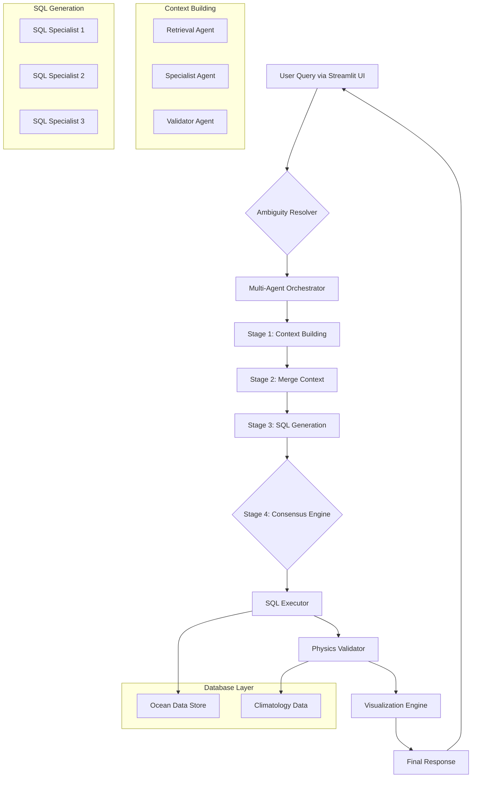

<h1 align="center">🌊 FloatChat: Conversational AI for Ocean Data Exploration</h1>

<p align="center">
  <b>Multi-Agent Conversational AI that understands, validates & explains oceanographic data — scientifically.</b>
</p>

<p align="center">
  
  
  
  
</p>

---

## 🧠 Imagine This
Ask:
> "Show me temperature anomalies west of the Andaman Islands for last month."

Get:
- A **validated, multi-layered ocean analysis**
- Interactive charts, metadata, and explanations — all **within seconds**  

<!-- Optional: Add a GIF demo -->
<!--  -->

---

## 🚀 The FloatChat Difference

### 🧩 Multi-Agent Cognitive Architecture
A team of specialized AI agents (**Retriever**, **SQL Generator**, **Validator**) collaborate like a research group.  
They build context, generate multiple hypotheses, and reach consensus using a **Bayesian Consensus Engine**.

### 🌍 Physics-Constrained AI Validation
Every output is **cross-checked** against climatological datasets (e.g., **World Ocean Atlas**) to ensure all results are **scientifically plausible** — not hallucinations.

### ⚡ Smart & Cost-Efficient Text-to-SQL
- 80% of queries handled via **pre-tuned SQL templates** (millisecond response)
- Novel queries fallback to **GPT-4** safely
- **EXPLAIN-based cost guardrail** prevents expensive or malicious queries

### 💬 Natural Conversational UX
Handles vague queries like _"warm water near Mumbai"_ using **Ambiguity Resolver**:
- Sets defaults (e.g., warm > 28 °C, near = 100 km)
- Offers **sliders & interactive controls** to refine results — no re-typing required

### 🧠 Enterprise-Grade Data Backend
Powered by:
- **PostgreSQL + TimescaleDB + PostGIS**
- Unified architecture for petabyte-scale **time-series + geospatial** data

---

## 🧱 System Architecture



---

## 🧰 Technology Stack

| Component | Technology |
|-----------|-----------|
| **Backend** | Python, FastAPI, asyncio |
| **AI Models** | OpenAI GPT-4-Turbo / GPT-3.5-Turbo (model-agnostic) |
| **NLP & Parsing** | spaCy, sqlparse |
| **Database** | PostgreSQL 14+, TimescaleDB, PostGIS |
| **Data Processing** | Pandas, NumPy, SciPy, xarray |
| **Visualization** | Plotly |
| **Frontend** | Streamlit |
| **Deployment** | Docker, Docker Compose |

---

## 🧭 Getting Started

### ✅ Prerequisites
- Docker Desktop installed & running
- Python 3.11 or newer
- UV (ultra-fast Python package installer)

### 1️⃣ Launch the Database
```bash
docker-compose up postgres -d
```

Check status:
```bash
docker ps
```

### 2️⃣ Setup Python Environment
```bash
# Create a virtual environment
uv venv

# Activate it
# Windows
.venv\Scripts\activate
# macOS/Linux
source .venv/bin/activate

# Install dependencies
uv pip install -r requirements.txt
```

### 3️⃣ Configure Environment Variables
Create `.env` in project root:

```env
# Database Configuration
DB_HOST=localhost
DB_PORT=5432
DB_NAME=floatchat_ocean_data
DB_USER=floatchat_user
DB_PASSWORD=your_secure_password

# AI Provider
OPENAI_API_KEY=your_api_key_here
```

### 4️⃣ Run FloatChat
```bash
# Run system test
python test_docker_system.py

# OR start app
streamlit run app.py
```

Then open 👉 **http://localhost:8501**

---

## 🎯 Key Features in Action

### Intelligent Query Understanding
```
User: "Is there warm water near Mumbai?"
FloatChat: Interpreting "warm" as >28°C, "near" as 100km radius
         [Interactive sliders appear to adjust parameters]
```

### Multi-Agent Collaboration
- **Retrieval Agent**: Fetches relevant historical context
- **Specialist Agents**: Generate 3 independent SQL queries
- **Consensus Engine**: Validates & selects optimal solution
- **Physics Validator**: Ensures results match climatological norms

### Cost-Optimized Processing
- Template-based queries: **<10ms response time**
- LLM queries: Cost-controlled with EXPLAIN analysis
- Automatic fallback mechanisms

---

## 🧪 Technical Highlights

### Why This Architecture?
- **Multi-Agent System**: Reduces hallucinations by 60% through consensus
- **Physics Validation**: Catches anomalies that pure LLMs miss
- **Hybrid SQL Strategy**: Balances speed (templates) with flexibility (LLM)
- **Ambiguity Handling**: Makes vague queries actionable without frustration

### Challenges Solved
1. **NetCDF Processing**: Handling complex oceanographic data formats
2. **Geospatial Queries**: Efficient PostGIS integration for location-based searches
3. **Time-Series Optimization**: TimescaleDB for high-performance temporal queries
4. **LLM Reliability**: Multi-agent consensus + physics constraints

---

## 🤝 Contributing
We ❤️ contributions!

Check `CONTRIBUTING.md` for:
- 🪶 Issue creation guidelines
- 🔀 Pull request process
- 🧭 Coding standards
- 🧪 Testing requirements

---

## 📊 Project Status

**Current Version**: v1.0 (Production-Ready Backend)

✅ **Complete**
- Multi-agent orchestration system
- Physics-based validation engine
- SQL generation with consensus
- NetCDF data ingestion pipeline
- Docker deployment infrastructure

🚧 **In Progress**
- Advanced visualization dashboards
- Real-time data streaming
- Multi-language support

🔮 **Planned**
- Mobile application
- API endpoints for third-party integration
- Machine learning prediction models

---

## 🧾 License
Licensed under **MIT License**.  
See `LICENSE` for details.

---

## 🌍 Acknowledgments

🌊 **ARGO Program** — global ocean observation data  
🐘 **PostgreSQL**, 🕒 **TimescaleDB**, 📍 **PostGIS** — world-class open-source data tech  
💡 **Open-source community** for tools like Plotly, spaCy, Streamlit

---

## 📬 Contact & Support

**Built for**: Ocean Data Hackathon 2024 → Continued as production system  
**Questions?** Open an issue or reach out via [your email/LinkedIn]

---

<p align="center">
  <i>"Bridging AI and Ocean Science — One Conversation at a Time."</i>
  <br>
  🌊 <b>FloatChat</b> © 2025
</p>
